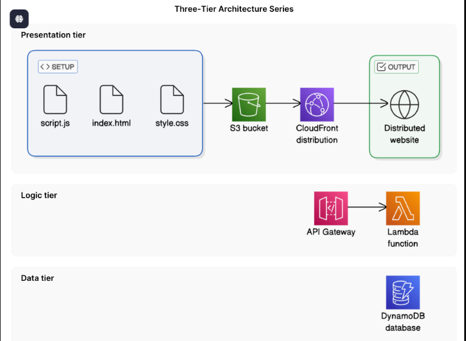
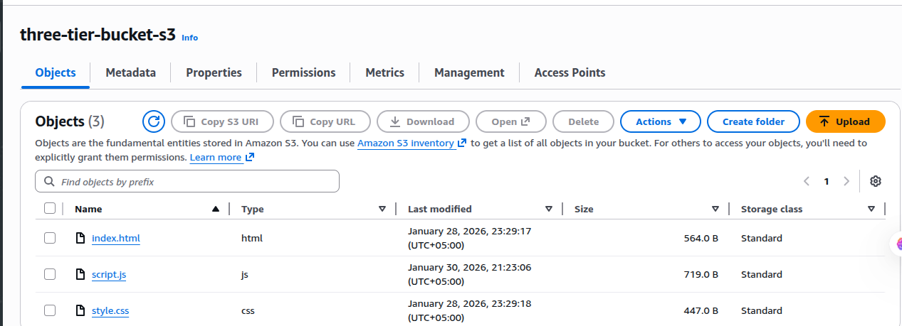
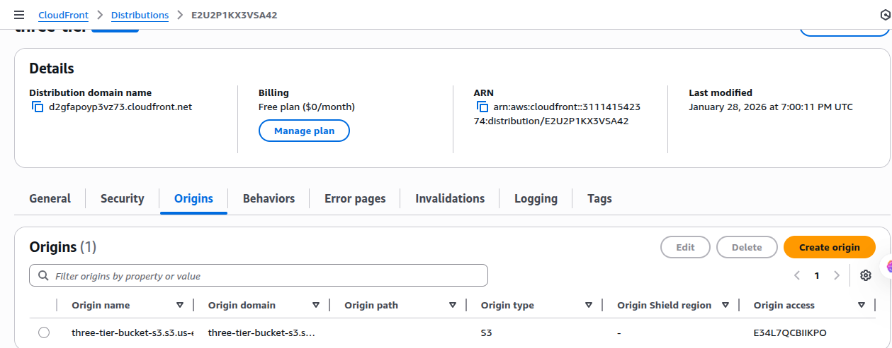

# Three-Tier Web Application on AWS

This project demonstrates how to build and deploy a **three-tier web application on AWS** using fully managed services.  
The architecture follows industry best practices for scalability, security, and performance.

---

## 🏗️ Architecture Overview

The application is structured into three logical tiers:

### 🔹 Presentation Tier
- **Amazon S3** – Hosts static website files
- **Amazon CloudFront** – Global CDN for fast and secure content delivery

### 🔹 Logic Tier
- **Amazon API Gateway** – Exposes REST APIs
- **AWS Lambda (Node.js)** – Handles business logic

### 🔹 Data Tier
- **Amazon DynamoDB** – NoSQL database for storing user data

---

## 🧩 Architecture Diagram

---

## ⚙️ Technologies Used

- AWS S3
- AWS CloudFront
- AWS Lambda (Node.js)
- AWS API Gateway (REST API)
- AWS DynamoDB
- IAM (Permissions & Roles)
- HTML, CSS, JavaScript

---

## 📌 Features

- Global website delivery using CloudFront
- Serverless backend using Lambda
- REST API integration with API Gateway
- Secure and scalable NoSQL data storage
- CORS-enabled API for browser access
- Fully serverless architecture (no EC2)

---

## 🛠️ Step-by-Step Implementation

### 1️⃣ Create S3 Bucket
- Store static website files (`index.html`, `script.js`, `style.css`)
- Upload website files

### 2️⃣ Configure CloudFront
- Create CloudFront distribution
- Connect S3 bucket using Origin Access Control (OAC)
- Set default root object to `index.html`

### 3️⃣ Create Lambda Function
- Node.js Lambda function
- Fetch user data from DynamoDB
- Return JSON response with CORS headers
  

### 4️⃣ Set Up API Gateway
- Create REST API
- Create `/users` resource
- Enable GET method with Lambda proxy integration
- Deploy API

### 5️⃣ Create DynamoDB Table
- Table name: `UserData`
- Partition key: `userId` (String)
- Insert sample user data

### 6️⃣ Integrate Frontend with API
- Update `script.js` to call API Gateway
- Upload updated files to S3
- Configure CORS
- Invalidate CloudFront cache

---

## ✅ Final Result

- User enters a `userId`
- Request flows through CloudFront → API Gateway → Lambda → DynamoDB
- User data is fetched and displayed on the website

---

## 📸 Screenshots

📂 Presentation Tier
1. S3 bucket with uploaded files
2. CloudFront distribution overview
3. CloudFront domain working in browser

📂 Logic Tier
4. Lambda function code
5. API Gateway `/users` GET method
6. API Gateway invoke URL working in browser

📂 Data Tier
7. DynamoDB table structure
8. DynamoDB item (userId, name, email)

📂 Final Result
9. Website UI before entering userId
10. Website UI after fetching user data
11. CloudFront invalidation screen (optional)

> **Tip:** Blur account IDs if visible.

---

## 🔐 Security Best Practices

- Origin Access Control for S3
- Restricted CORS to CloudFront domain
- IAM least privilege access for Lambda
- No public database access

---

## 📈 What I Learned

- Designing and deploying a three-tier architecture
- Serverless application development on AWS
- CloudFront + API Gateway integration
- Debugging CORS and Lambda event issues
- End-to-end AWS service integration

---

## 🙌 Author

**Your Name**  
AWS Enthusiast | Cloud Learner
